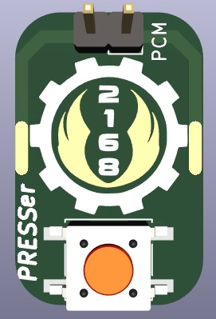

# PRESSer
FRC pressure switch breakout board



* Soldered directly to the back of the Nason Pressure switch. Tabs get covered in heat shrink.
* Allows for easy testing of `shorting` the pressure switch during inspection by holing down the onboard button (to check dump valve on over-pressurization)
* Adds a 2.54" pin header for easy wiring into the switch.

This is a [KiCad](https://www.kicad.org/download/) 6.x project.  
The gerbers can be used to order from any PCB fab house.

Panelized PCBs were generated using the [kikit](https://github.com/yaqwsx/KiKit/) project using the following command:

```
kikit panelize --layout "grid; rows: 3; cols: 3; space: 2mm" --tabs "annotation" --source "tolerance: 5mm" --cuts "mousebites; drill: 0.5mm; spacing: 1mm; prolong: 0.5mm" --post "millradius: 1mm" PressureSwitchBreakout.kicad_pcb panel.kicad_pcb
```
